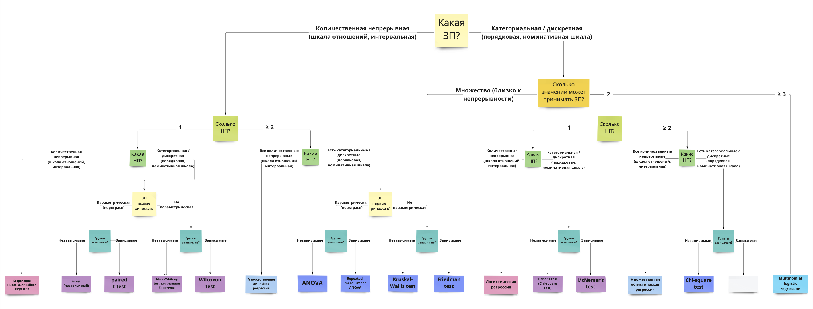
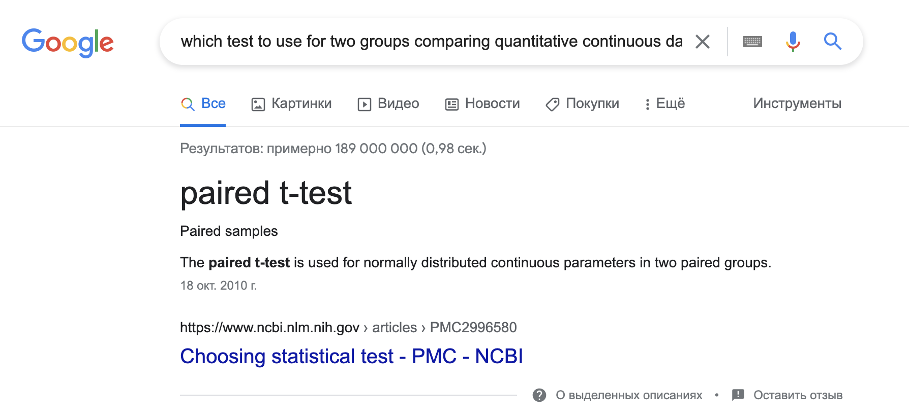
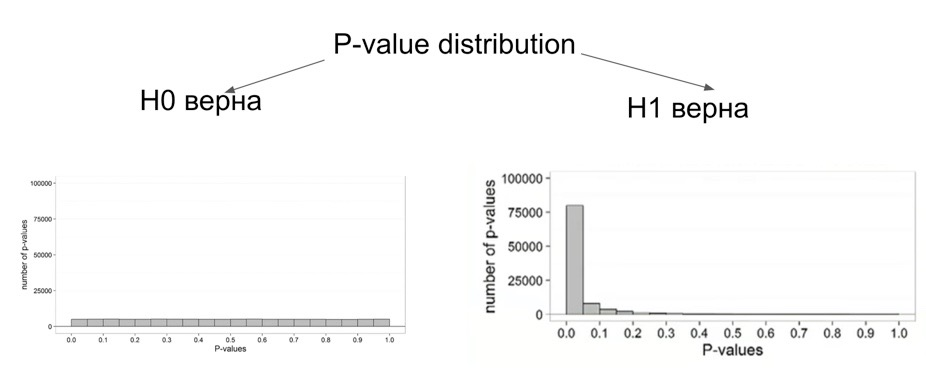
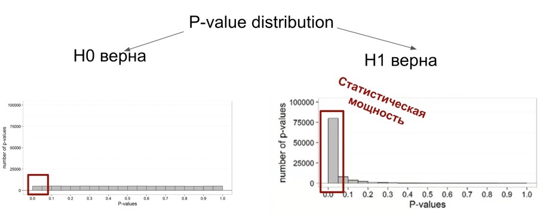
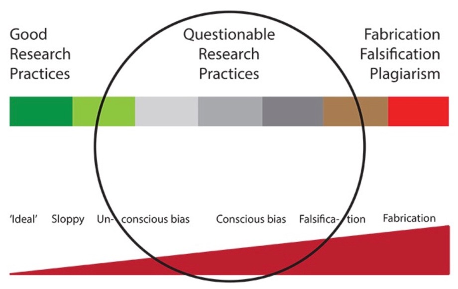
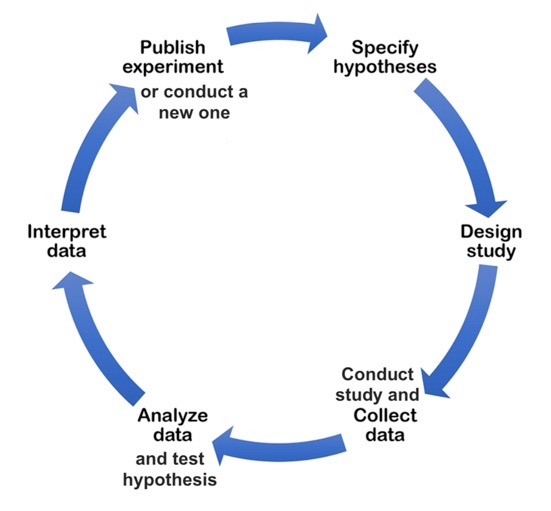
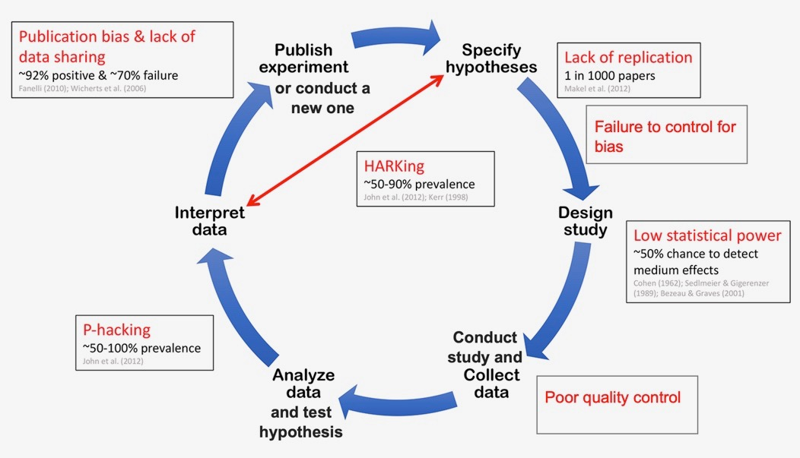
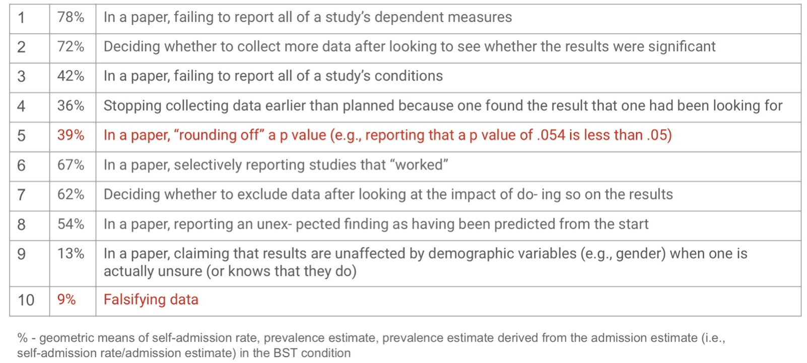
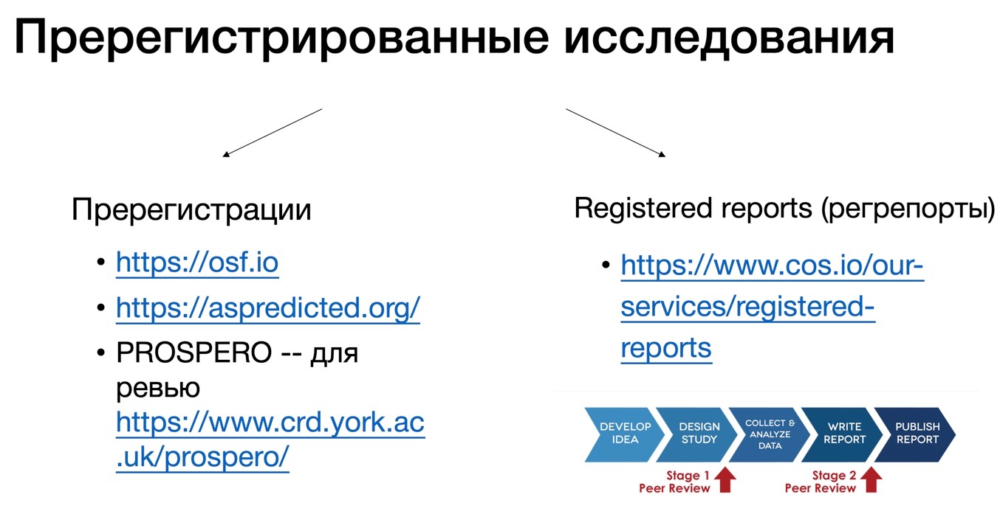

--- 
title: "Прикладной анализ данных"
author: "Елена Рыбина"
date: "`r Sys.Date()`"
site: bookdown::bookdown_site
documentclass: book
bibliography:
- book.bib
- packages.bib
description: |
  Занятие по прикладному анализу данных.
link-citations: yes
github-repo: elenary/AppAnDan
---
```{r, eval=TRUE,echo=FALSE}
library(tidyverse)
library(viridis)
library(knitr)
library(kableExtra)
```


```{r opts, echo = FALSE}
knitr::opts_chunk$set(fig.path = "images/")

# knitr::include_graphics(rep("images/knit-logo.png", 3))
```
# Чек-лист работы с данными

Рассмотрим, как должен выглядеть чек-лист работы с данными для проверки себя, если бы эти экспериментальные данные мы собирали бы сами?

*-----Теоретический этап, планирование работы с данными-----*

1. Сформулированы теоретические гипотезы.
2. Сформулированы эмпирические гипотезы (метод исследования, операционализированные ЗП и НП).
3. Есть понимание, как будут выглядеть собранные данные.
4. Выбраны уровень значимости и статистическая мощность.
5. Выбран статистический метод проверки экспериментальной гипотезы *(и хорошо, если есть понимание о статистической гипотезе -- это уже про H0 и H1)*
6. Расчитан размер требуемой выборки (на уровне выбранной стат мощности и ожидаемого размера эффекта с применением выбранного метода).
7. Выбрана среда для анализа данных и алгоритмы и пакеты для анализа.

*-----Данные собраны-----*

8. Данные предобработаны и приведены в вид, к которому можно применить выбранные статистические методы.
9. Предобработанные переменные исследованы описательными статистиками и визуализированы для лучшего понимания данных.
10. Проведен расчет выбранного статистического метода с помощью выбранной функции.
11. Результаты визуализированы, так, чтобы их было легче правильно интерпретировать.
12. Результаты проинтепретированы и сделан вывод относительно изначальной эмпирической гипотезы.

Теперь пройдемся подробнее по некоторым из этих пунктов.

В качестве примера возьмем датасет с kaggle <https://www.kaggle.com/datasets/uciml/student-alcohol-consumption>.
Это -- данные из двух португальских школ (скорее колледжей) с подробной социо-демографической информации о студентах, включая ту, как они учатся по математике и португальскому языку и как часто пьют алкоголь. Этот датасет я взяла, так как он содержит переменные разного типа данных в разных шкалах (и шкала отношений, например, возраст, и порядковая шкала, например, рейтинггования образования мамы или папы или поддержка в семье).

```{r, eval=TRUE}
studens_mat <- read_csv("student-mat.csv")
studens_mat %>% 
  rename_with(., ~ paste0(., "_mat"), .cols = c(absences, paid, G1, G2, G3)) -> studens_mat #переименовываю колонки для упрощения понимания, какие относятся к математикие
kable(studens_mat[1:10,]) %>% scroll_box(width = "100%") #визуализирую табличку для этой книжки
```

```{r, eval=TRUE, results = "asis"}
studens_por <- read_csv("student-por.csv")
studens_por %>% 
  rename_with(., ~ paste0(., "_por"), .cols = c(absences, paid, G1, G2, G3)) -> studens_por
kable(studens_por[1:10,]) %>% scroll_box(width = "100%") #визуализирую табличку для этой книжки
```


# Теоретические гипотезы

{width=2%}  **Сформулированы теоретические гипотезы**

*<Здесь на парах мы придумывали гипотезы>*

Возьмем первую придуманную гипотезу: в датасете есть студенты возрастов от 15 до 22 двух лет. Возможно, `те, кто младше, будут бояться признаться в употрблении алкоголя и отвечать так, будто не употрябляют его`. Они вляются несовершеннолетними и могут бояться, что родители узнают.

Эта гипотеза хороша тем, что она имеет понятное теоретическое обоснование, она проверяема на наших данных, и данные подходят для того, чтобы ее проверить

Вторая гипотеза: `студенты с менее поддерживающими отношениями в семье чаще употребляют алкоголь`. Эта гипотеза так же понятна, имеет теоретическое обосноование, проверяема в исследовании, и наши данные подходят для ее проверки.

У меня была еще одна, третья гипотеза: что `студенты, пропускающие много занятий, буду иметь более низкий средний балл по математике и португальскому`.

# Эмпирические гипотезы

{width=2%}  **Сформулированы эмпирические гипотезы**

Эмпирические гипотезы -- те, которые мы можем проверить опытным путем. Чтобы правильно их сформулировать, нам надо также определиться с типом эмпирического исследования, которое возможно для проверки наших теоретических гипотез. В психологических исследованиях это чаще всего **эксперимент**, **квази-эксперимент**, **корреляционное исследование** (и **лонгитюдное исследование** как его подвид). Иногды бывает **case study**, исследование одного конкретного случая, чаще в когнитивной психологии и нейронауках.

В нашем случае все гипотезы рождены из одного заполнения опросника -- значит, все, о чем мы можем говорить, это корреляции. Чуть позже поодробнее рассмотрим, почему, а пока попробуем сформулировать эмпирические гипотезы. **Эмпирические гипотезы** -- это теоретические гипотезы, сформулированные в проверяемом для нашего исследования виде, то есть переведенные на язык исследования, исходя из наших предполагаемых переменных и их значений. В нашем случае теоретические гипотезы получились уже довольно конкретными, но давайте еще более точно операционализируем их и поясним, что в нашем исследовании мы будем иметь в виду под "много" или "мало", какие переменные будут будем исследовать?

Гипотеза 1 в контексте нашего исследования и существующих переменных может звучать так: `студенты возраста 15-17 лет (age) при ответе на вопрос об употреблении алкоголя в выходные дни (Walc) будут выбирать варианты ответов, ассоциированные с как можно более редким употреблением - 1 или 2`

Гипотеза 2 `Студенты, кто оценивает отношения с родителями как менее поддерживающие (famrel, менее поддерживающие в значениях 1-2), чаще употребляют алкоголь (Walc, употребление в выходные дни, значения 4-5)`

Гипотеза 3 `Студенты, у кого было много пропусков (absences_mat или absences_por, высокие значения), будут иметь более низкий средний балл (среднее из G1_mat, G2_mat, G3_mat или G1_por, G2_por, G3_por -- низкие значения)`

Давайте сначала подумаем, что это за гипотезы, какие зависимые и независимые переменные, наличие или отсутствие какой связи между зависимой и независимыми переменными нам хочется проверить?

## Зависимые (ЗП) и независимые (НП) переменные в гипотезе

Рассмотрим гипотезу 1. Что в ней является зависимой и независимой переменной? 

Сейчас гипотеза сформулирована так, что НП -- это возраст (age), а ЗП -- это количество употребления алкоголя Walc. Согласны ли вы с таким разделением? Почему?
Иногда бывает сложно определить, что будет являться зависимой и независимыми переменными. Независимые переменные -- это все, чем мы манипулируем по ходу проведения исследования, с целью получить разный результат. Зависимая -- целевая переменная, то, что мы измереяем, изменения в чем мы ожидаем получить после манипуляции независимыми переменными.
При описании исследования всегда важно записывать ЗП и НП, наряду с экспериментальной (эмпирической) гипотезой -- сердце нашего исследования, самое основное из языка, на котором описывается исследование.

Следующий вопрос -- к какой шкале относятся ЗП и НП? Это важно понимать, чтобы потом выбрать, как анализировать данные.

## Типы шкал

Шкала | Описание                                       | Возможные операции | Примеры              | 
------| -----------------------------------------------| ------------------ | -------------------- | 
**Наименований (номинальная)** | Качественная (категориальная), нельзя установить "больше" или "меньше" | =, $\neq$ | shcool, sex, address, famsize, Mjob, Fjob, schoolsup | 
**Порядка (ранговая)**         | Качественная (категориальная), можно установить "больше" или "меньше", но нельзя посчитать количественно, на сколько больше или меньше | =, $\neq$, >, < | Medu, Fedu, traveltime, studytime, famrel, freetime, goout, Dalc, Walc, health | 
**Разности (интервальная)**    | Количественная, но нет абсоолютного нуля, можно посчитать  *на сколько* больше или меньше, но нельзя посчитать, *во сколько раз* | =, $\neq$, >, <, +, - | G *(отнесу сюда, так как с оценками все сложно)*  | 
**Отношений (абсолютная)**     | Количественная, есть абсолютный ноль, можно посчитать и *на сколько* больше или меньше, и *во сколько раз* | =, $\neq$, >, <, +, -, ×, ÷ | age, failures, absences | 

Опишем переменные для гипотезы 1. Возраст (age) -- это количественная переменная, в целом про возраст мы можем сказать, что он непрерывен (здесь возраст округлен до целых, поэтому на которотком промежутке возрастов это может сыграть роль) Чуть позже посмотрим на переменную возраста в описательных статистиках, чтобы убедиться, что можем работать с ней как с непрерывной переменной. У возраста есть абсолютный ноль (нельзя быть возраста "-10 лет"), можем сказать, что человек возраста 30 лет в два раза старше человека возраста 15 лет, поэтому возраст относится к шкале отношений.

Walc -- явно относится к порядковой шкале: можем сказать, что студенты, ответившие "4" на вопрос про употребление алкоголя, употребляют его больше, чем те, кто выбрал "2", но не можем сказать, что в количестве выпитого алкоголя эта разница выражается как в два раза больше.

*К каким шкалам относятся переменные для гипотезы 2 и гипотезы 3?*

## Связь между ЗП и НП: какая она бывает?

Сейчас гипотезы 1 - 3 сформулированы так:

> `студенты возраста 15-17 лет (age) при ответе на вопрос об употреблении алкоголя в выходные дни (Walc) будут выбирать варианты ответов, ассоциированные с как можно более редким употреблением - 1 или 2`

> `Студенты, кто оценивает отношения с родителями как менее поддерживающие (famrel, менее поддерживающие в значениях 1-2), чаще употребляют алкоголь (Walc, употребление в выходные дни, значения 4-5)`

> `Студенты, у кого было много пропусков (absences_mat или absences_por, высокие значения), будут иметь более низкий средний балл (среднее из G1_mat, G2_mat, G3_mat или G1_por, G2_por, G3_por -- низкие значения)`

Мы выяснили, что в первой гипотезе НП -- это возраст (age), а ЗП -- это количество употребления алкоголя Walc. Во второй гипотезе НП -- оценка отношений с родителями (famrel), и та же ЗП (Walc). То есть, разворачивая такую формулировку, мы считаем, что возраст и качество отношений в семье влияет на ответы. Если смотреть на данные, выводы о какой связи мы можем установить?

Два основных вида связи между переменными:

* **Ассоциативная или корреляционная**
* **Причинно-следственная**

Три необходимых условия для установления **причинно-следственной связи**:

1. Изменение НП произошло раньше, чем мы пронаблюдали изменение в ЗП
2. Изменения НП имеют ассоциативную связь с изменениямм в ЗП 
3. Нет никаких альтернативных объяснений изменений в ЗП, помимо изменений НП


Сейчас у нас есть только опросные данные, в которых студенты отвечали на вопросы одновременно. Получается, что в таком дизайне исследования мы не проходим необходимые условия для установления причинно-следственной связи, следовательно, сделать вывод о причинно-следственной связи не можем. Причинно-следственную связь мы можем установить только в ходе **эксперимента** или **квази-эксперимента** (отличается от эксперимента тем, что испытуемые не распределяются в группы рандомно, а используются уже существующие в популяции группы, например, разные страны). Во всех остальных видах исследований, особенно, когда исследуется связь переменных в одном самоотчете или опроснике, мы можем говорить только об ассоциативной или корреляционной связи.

Важно отметить, что вполне возможно, на самом деле в популяции эта связь и будет причинно-следственной. Вполне вероятно, что плохие отношения в семье приводят у алкоголизму у детей. Но у нас в нашей выборке есть только такие данные -- из опросника, и из тех данных того исследования, которые у нас есть, мы можем судить только о наличии или отсутствии корреляции.

При формулировании выводов эти выводы могут отличаться так, сравните:
- Вывод 1: "Менее поддерживающие отношения в семье вызывают алкоголизм".
- Вывод 2: "Менее поддерживающие отношения в семье ассоциированы с высоким риском алкоголизма".

Несмотря на то, что мы говорим о корреляции, тут тоже есть варианты. Сравните варианты формулировок для гипотезы 1: `чем меньше возраст студентов (age), чем ниже будут ответы в переменной Walc` и `студенты возраста 15, 16, 17 лет будут выбирать меньшие варианты ответа в переменной Walc` или `студенты возраста 15 лет будут выбирать меньшие варианты ответа в переменной Walc`. Чем они отличаются? 

## Гипотезы о наличии линейной связи между НП и ЗП и гипотезы о разнице между группами по значению ЗП

Первый вариант этой гипотезы -- это гипотеза о наличии ассоциативной (корреляционной) связи между ЗП и НП: чем больше / меньше значение НП, тем больше / меньше значение ЗП. Здесь для гипотезы нам важно, что увеличение НП на *каждый* произвольный интервал будет вызывать какие-то пропорциональные изменения в каждом таком же интервале ЗП.

Второй и третий варианты подразумевают сравнения групп по какому-либо параметру центральной тенденции (среднее, медиана, мода) ЗП. Чаще всего, когда речь идет о сравнении групп, сравниваются средние значения ЗП в этих группах (в т-тестах, тестах Уилкоксона и Манна-Уитни, и даже в дисперсионном анализе АНОВА на самом деле сравниваются не дисперсии, а средние). Здесь мы выделяем группы: "студенты младше 18 лет" и "студенты 18 лет и старше", или "студенты возраста 15 лет" и "студенты возраста НЕ 15 лет".

От этого, хотим мы проверить наличие или отсутствие линейной связи между переменными или сравнить средние значения в нескольких группах, будет так же зависеть выбор статистичекого метода для проверки гипотезы. Вернемся к этому в разделе [Выбор статистического метода, уровня значимость и статистической мощности (статистики вывода)]

## Уровни НП в качественных переменных

Об уровнях в НП говорят в категориальных (порядковых или номинативных), качественных переменных. Например, условия "часто" и "редко", условия "обеспеченная семья" или "не обеспеченная". В примерах выше для гипотезы `чем меньше возраст студентов (age), чем ниже будут ответы в переменной Walc` мы не можем выделить уровни НП, ЗП непрерывная, тем более, это гипотеза о наличи линейной связи между переменными, связи каждого значения НП с каждым значением ЗП, уровни тут невозможны. Однако в гипотезе `студенты возраста 15, 16, 17 лет будут выбирать меньшие варианты ответа в переменной Walc` мы собираемся сравнить две группы, и здесь можно говорить об уровнях НП age -- "студенты младше 18 лет" и "студенты 18 лет и старше". Чтобы это сделать, нам нужно будет перекодировать переменную `age` в новую, категориальную переменную, со значениями "младше 18 лет" и "18 и старше", сделаем это в разделе [Препроцессинг].


# Представление о собранных данных

{width=2%}  **Есть понимание, как будут выглядеть собранные данные**

Итак, мы подробно разобрались, какие у нас гипотезы. Теперь можно подумать о том, как будут выглядеть собранные данные для проверки этих гипотез.

Здесь мы работаем с уже готовым датасетом, поэтому понимание о собранных данных у нас есть. Но в реальной жизни прежде, чем начинать сбор данных, нужно хорошо представлять себе, как будут записываться данные: это логи  в текстовом файле, и нам нужно будет вручную выковыривать их него цифры и собирать табличку? Если да, можно ли это автоматизировать? Или это эксель-табличка, в которую данные будут писаться в уже пригодном для работы виде? Если нет, можем ли мы сделать так, чтобы данные писались в такую удобную табличку, еще на этапе кодирования эксперимента? Этот самый момент, когда мы уже определили гипотезы и отправляемся разрабатывать дизайн эксперимента и кодировать его в PsychoPy или другой среде. До запуска эксперимента нужно будет понимать, как мы будем собирать данные, как они будут выглядеть, сможем ли мы сделать с ними все, что хотим, применить нужный статистический метод?

# Выбор уровня значимости и статистической мощности

{width=2%}  **Выбраны вероятностные рамки, в которых будет проводиться тестирование гипотезы: уровень значимости и статистическая мощность.**

До кодирования эксперимента или в начале кодирования мы так же определеяем, какие статистические методы будем использовать для проверки гипотез.

Сейчас, в случае с уже готовым дататестом, все не совсем так, и мы на уже готовом датасете пытаемся восстановить изначальные гипотезы, для проверки которых этот датасет собирался. Вообще пытаться прикрутить гипотезу к уже собранным данным --  это **плохая научная практика**, которая приводит к большому числу ложноположительных результатов. Об этом мы подробно поговорим в теме [Questionable and good research practices].

Раздел статистики, который относится к установлению выводов относительно взаимосвязи между переменными в популяции (генеральной совокупности) по данным нашей небольшой выборки, ровно так и называется: **статистический вывод**, или **inferential statistics**. Наша цель в статистическом выводе -- имея данные только нашего небольшого исследования получить ответы на вопросы относительно всей популяции: *связаны ли незавасимые и зависимая переменные в популяции между собой, и если да, то как? Выделяются ли группы в популяции между собой по значением зависимой переменной, и если да -- обусловлены или эти изменения варьированием нашей независимой переменной?* Для этого нам нужно выбрать **статистический метод**, которым мы будем проверять гипотезу, и условия, в которых он прооводится: **уровень значимости** и **статистическую мощность**.

## Проверка статистических гипотез (NHST, Null Hypothesis Statistical Testing)

Давайте немного разберемся, что проиходит, когда мы применяем какой-либо статистический метод для проверки гипотез (т-тест, Уилкоксона или Манна-Уитни, АНОВА, линейная регрессия, логистическая регрессия и тд).

Что вообще мы имеем в виду под **проверкой гипотез**? У нас есть какое-то предположение о том о связи неких психологических конструктов относительно того, как работает психика у людей в целом (теоретическая гипотеза). Мы придумываем дизайн исследования и уточняем уже эмпирическую гипотезу на языке исследования, делаем ее более конкретной, операционализируем наши конструкты. Далее проводим исследование и собираем данные на нашей выборке, часто не очень большой (обычно размер выборки варьируется от 30 до 100 человек, подробнее обсудим при рассмотрении статистической мощности). Проводим расчет статистического метода и делаем вывод по эмпирической гипотезе о связи наших конструктов, в том смысле, в котором мы их операционализировали. И когда мы делаем выводы, мы говорим не о нашей небольшой группе людей, которых мы исследовали -- а о всей популяции людей, она называется **генеральной совокупностью**. Почему так можно?
<p align="center">


</p>
<p align="center">
*Изображение с https://towardsdatascience.com/*
</p>

Собственно, за это и отвечает математика и теория вероятностей, заложенные внутрь статистических тестов. Мы предполагаем, что люди, участвующие в нашем исследовании -- рандомные представители генеральной совокупности (ха-ха, так, конечно, никогда не бывает, но воообще важно, чтобы то, что мы исследуем только русскоязычных людей или студентов психфака не влияло на нашу зависимую переменную). И когда мы применяем статистический метод, мы оцениваем, *какова вероятность, при условии, что мы выбрали случайных людей, получить такие результаты о связи НП и ЗП во всей генеральной совокупности?*

Когда мы проводим расчет статистического метода, мы получаем несколько цифр, одна из них, про которую все наверняка уже слышали и к которой часто формируется благовейный трепет -- p-value. На самом деле, *это только одна из связки цифр, которые нужны нам для точного статистического вывода*, сама по себе в вакууме она бессмысленна. Но в связке с другими цифрами она дает нам возможность понять, какова вероятность (p for probability) получить результат, который мы получили, в генеральной совокупности? И если по условиям теста полученная вероятность нас устраивает, мы делаем вывод. Пройдемся подробнее по шагам этого вывода. 

**Алгоритм NHST**

0. **Формулируем эмпирическую гипотезу** (это мы уже сделали выше)
1. **Формулируем нулевую** $H_0$ **и альтернативную** $H_1$ **гипотезы.** 
Для того, чтобы провести статистический тест, нужно определить еще статистическую гипотезу -- тестируемое утверждение об отсутствии различий между группами (если гипотеза подразумевает сравнение групп) или об отсутствии связи между переменнами (если гипотеза про связь). Это $H_0$, **нулевая гипотеза**, которую мы пытаемся опровергнуть в статистическом тестировании (*да, именно опровергнуть, а не подтвердить -- выводы, которые мы можем сделать отноосительно нулевой гипотезы -- только отвергнуть или не отвергнуть, не можем подтвердить ее и принять*). Противоположная к нулевой гипотезе -- **альтернативная гипотеза**, $H_1$. Это статистическая гипотеза, противоположная $H_0$, о разнице между группами или о наличии связи. Удобно, когда она тоже сформулирована, чтобы всем придерживаться одного языка статистических тестов. 
2. **Выбираем условия, при котором будем рассчитывать статистический критерий -- уровень значимости и статистическую мощность.** 
Уровень значимости $\alpha$ -- вероятность получить случайный результат, если на самом деле его нет, чаще всего α = 0.05, и $power$, вероятность того, что если в популяции есть эффект, мы найдем его она данных. $power$ = $1 - \beta$, где $\beta$ -- вероятность случайно не получить результат, если на самом деле он есть. Чаще всего $power = 0.8$.  К этому мы перейдем сразу в следующем подразделе [Выбор уровня значимости и статистической мощности]
3. **Выбираем статистический критерий для проверки** (t-test, Wilcoxon/Mann–Whitney–test, ANOVA, lm) -- этому посвящен следующий подраздел [Выбор статистических методов для разных гипотез].
4. **Считаем размер выборки**
Сколько данных нужно собрать при выбранном статистическом тесте и ожидаемом размере эффекта, выбранном уровне значимости $\alpha$ и выбранной статистической мощности $power$ -- рассмотрим в следующем подразделе [Расчет размера выборки на основании статистической мощности, уровня значимости и статистического критерия]
5. **Проводим выбранный выбранный статистический тест** -- получаем статистику (например, t-значение, F-значение, R -- коэффициент корреляции или процент объясненной дисперсии) и p-value.
6. **Делаем вывод: сравниваем p-value с выбранным уровнем значимости  α, считаем размер эффекта** 

## Выбор уровня значимости и статистической мощности

Уровень значимости $\alpha$ и статистическая мощность $power$ -- это два их самых важных параметров в тестировании гипотез. Эти понятия задают вероятностные рамки, в которых мы будем проводить тест. Первая рамка -- это вероятность получить значимый результат (различия или связь), если его на самом нет в генеральной совокупности -- **ложноположительный результат, false positive**, она же **ошибка первого рода $\alpha$**. Вторая рамка -- вероятность получить незначимый результат, если его на самом деле нет в генеральной совокупности -- **ложноотрицательный результат, false negative**, она же **ошибка второго рода $\beta$**. Скорее всего, вы уже сталкивались с такой таблицей:

<p align="center">
{width=60%}
</p>


Другой популярный вариант для объяснения ошибок первого и второго рода:

<p align="center">
{width=70%}
</p>
Вероятность, при которой в генеральной совокупности нет разницы между группами или связи, но мы получили ее на наших данных -- это и есть **уровень значимости $\alpha$ **, который мы задаем сами (!). А вероятность, при которой в генеральной совокупности на самом деле есть разница между группами или связь, но мы не получили ее на наших данных -- это **$\beta$ = 1 - статистическая мощность теста**.

**Уровень значимости** 	$\alpha$ -- это уровень вероятности, при достижении которого мы будем считать, что нулевая гипотеза $H_0$ подтвердилась, и значимых различий или связи между переменными нет. Это просто значение из пространства вероятностей получить значимый результат случайным образом, при условии, что его на самом деле нет в генеральноой совокупности. Психологи просто выбрали значение $\alpha = 0.05$ и решили, что 5% ложноположительных результатов в психологии -- подходящий вариант (*сейчас идет большая дискуссия, так ли это*). А если мы возьмем, например, физику элементарных частиц, то здесь речь об открытии новой частиц идет только на уровне $\alpha = 0.000001$!  

**Уровень статистической мощности (statistical power)** -- это положительная метрика, уровень вероятности, при котором мы гарантируем, что если различия между группами или связь между переменными есть в генеральной совокупности, то мы сможем найти ее на наших данных при помощи нашего статистического теста. Если смотреть на таблицу ошибок первого и второго, статистическая мощность это $1 - \beta$, то есть обратная величина к вероятности ошибки второго рода, не найти значимый эффект, если он есть $\beta$ (статистическая мощность и вероятность ошибки второго рода -- противоположные понятия, в суммме эти вероятности дают 1). В психологии конвенционально сложилось, что чаще всего статистическую мощность принимают на уровне $power = 0.8$

# Выбор статистического метода

{width=2%}  **Исходя из гипотезы и того, как будут собраны и какие это данные, выбран статистический метод проверки экспериментальной гипотезы**

Следующий шаг, с которым надо надо определиться -- выбрать метод для тестирования наших гипотез. Посмотрим на гипотезы.

Гипотезу 1 мы сводили к нескольким вариантам: 

> `a) "студенты возраста 15, 16, 17 лет будут выбирать меньшие значения переменной Walc, чем студенты 18 лет и старше" `

> `b) "студенты возраста 15 лет будут выбирать меньшие значения переменной Walc, чем студенты 16 лет и старше `

Как можно их проверить? Это звучит как тест-сравнение двух или нескольких средних по позрастам,  15-17 лет и 18-22 (первый вариант) и 15 лет и 16-22 года (второй вариант). 


Гипотезу 2 будем проверять в виде: 

> `Чем ниже студенты оценивают качества семейных отношений famrel, тем выше они отмечают частоту употребления алкоголя Walc `

Здесь у нас нет групп, мы проверяем гипотезу о наличии связи между переменными (условно -- чем больше значение НП, тем больше или меньше значение ЗП, с ростом НП также происходят изменения и в ЗП)

Гипотеза 3:

> `Студенты, у кого было много пропусков (переменная absences_mat или absences_por, высокие значения), будут иметь более низкий средний балл (среднее из переменных G1_mat, G2_mat, G3_mat или G1_por, G2_por, G3_por -- низкие значения)`

Как понять, какой тест выбрать? Это, наверное, один из самых сложных вопросов в статистике.

**Вопросы, которые влияют на принятие решения относительно статистического теста:**

1. Зависимая переменная непрерывная (интервальная шкала или шкала отношений) или категориальная / дискретная (номинативная или порядковая шкала)?
2. Если ЗП непрерывная -- она описывается параметрическим (чаще всего нормальным) распределением? *(определяется чаще "на глаз" по графику плотности вероятности или QQ-графиками, тесты на нормальность почти всегда будут давать негативный результат из-за чувствительности и поэтому в современном анализе данных используются мало)*
3. Сколько независимых переменных?
4. НП непрерывные (интервальная и шкала отношений) или категориальные / дискретные (номинативная и порядковая)?
5. Если НП категориальные и мы сравниваем группы -- данные в группах зависимы или нет? Если нет, как сильно отличаются данные в группах, можем ли сказать, что дисперсия ЗП примерно одинакова в группах или нет? (*равенство дисперсий называется Homogeneity of Variance, проверяется с помощью Levene's test*)

Есть большое количество схем, но обычно они сильно перегруженны и сложны в использовании, больше путают, чем помогают. 

Но я зачем-то все равно решила попробовать нарисовать свою, и вот результат:
<https://miro.com/app/board/uXjVOxmKhr8=/?share_link_id=245423331470>
<p align="center">

</p>

Здесь не все возможные методы статистической проверки гипотез. Однако, скорее всегоо, тут отображены большинство методов, которые могут вам понадобиться в психологических исследованиях. *Надеюсь, вы сможете разобраться, и вам будет полезно*

**Эти же методы списком:**

* ЗП количественная, непрерывная, и одна НП, количественная, непрерывная -- корреляция Пирсона (Pearson correlation) или линейная регрессия (linear regression).

------

* ЗП количественная, непрерывная, и две и более НП, количественные, непрерывные -- множественная линейная регрессия (multiple linear regression).

------

* ЗП количественная, непрерывная, и параметрическая, и одна НП, категориальная, дискретная. Группы НЕзависимые -- independent t-test.

------

* ЗП количественная, непрерывная, и параметрическая, и одна НП, категориальная, дискретная. Группы зависимые -- paired t-test.

------

* ЗП порядковая или НЕпараметрическая, и одна НП, категориальная, дискретная или количественная, непрерывная. Ассоциативная связь -- корреляция Спирмена (Spearman correlation). Если группы, НЕзависимые -- Mann-Whitney test.

------

* ЗП порядковая или НЕпараметрическая, и одна НП, категориальная, дискретная или количественная, непрерывная. Ассоциативная связь -- корреляция Спирмена (Spearman correlation). Если группы, зависимые -- Wilcoxon test.

------

* ЗП количественная, непрерывная, и параметрическая, и две и более НП, категориальные, дискретные. Группы НЕзависимые -- ANOVA.

------

* ЗП количественная, непрерывная, и параметрическая, и две и более НП, категориальные, дискретные. Группы зависимые -- repeated-measurment ANOVA.

------

* ЗП порядковая или НЕпараметрическая, и две и более НП, категориальные, дискретные. Группы независимые -- 	Kruskal-Wallis test.

------

* ЗП порядковая или НЕпараметрическая, и две и более НП, категориальные, дискретные. Группы зависимые -- 	Friedman test.

------

* ЗП категориальная, может принимать два значения, и одна НП, количественная, непрерывная -- логистическая регрессия (logistic regression)

------

* ЗП категориальная, может принимать два значения, и две и более НП, количественные, непрерывные -- множественная логистическая регрессия (multiple logistic regression)

------

* ЗП категориальная, может принимать два значения, и одна НП, категориальная, дискретная. Группы НЕзависимые -- Fisher's test (Chi-square test).

------

* ЗП категориальная, может принимать два значения, и одна НП, категориальная, дискретная. Группы зависимые -- McNemar's test.

------

* ЗП категориальная, может принимать БОЛЕЕ двух значениq, и одна  или более НП, количественных, непрерывных -- мультиномиальная логистическая регрессия (Multinomial logistic regression, multivariate logistic regression)

------

В целом, если разобраться в тестах не получилось, ответы на эти вопросы помогают сформировать запрос и дальше отправиться в гугл или к коллегам с конкретным вопросом, например *какой тест использовать для сравнения двух независимых групп в количественной шкале?* Я подразумевала, что можно почитать статьи из поисковой выдачи, но оказалось, что гугл даже научился иногда отвечать на этот вопрос...



# Расчет размера выборки

После того, как мы выбрали уровень значимости, уроовень статистической мощности и статистический критерий, который мы будем использовать для проверки гипотезы, нам нужно рассчитать, сколько наблюдений нужно набрать, чтобы сделать точный вывод с учетом всех выбранных нами допущений и вероятностей относительно ложнооположительного и ложноотрицательного вывода?

Этот пункт раньше часто пропускался: казалось, что размер выборки не требует определенного расчета, и достаточно опираться на предыдущие исследование. Оказалось, что это не так, подробнее о последствиях такого подхода в следующем подразделе [Questionable and good research practices].

Размер выборки неразрывно связан с тремя другими параметрами: статистической мощностью (чаще всего выбираем на уроовне 80%), уровня значимости и размера эффекта. Он рассчитывается на основании статистической мощности, уровня значимости и ожидаемого размера эффекта выбранного статистического критерия

**Размер эффекта** -- это величина наблюдаемых различий. За степень различий отвечает не полученная статистика после примененного статистического критерия (например, t-значение, F-значение), и не p-значение, а отдельная метрика. Эта метрика расчитывается по формулам индивидуально для каждого статистического теста. Например, для t-testа размер эффекта -- это Cohen's d. В психологических исследованиях размер эффекта редко бывает большим. И чем меньше ожидаемый размер эффекта, тем больше наблюдений нам надо собрать для возможности сделать точный вывод о наличи или отсутствии различий в генеральной совокупности.

<p align="center">
{}
</p>

Зная статистическую мощность, уровень значимости и размер эффекта -- размер выборки можно рассчитать в Gpower https://www.psychologie.hhu.de/arbeitsgruppen/allgemeine-psychologie-und-arbeitspsychologie/gpower или в R, например, с помощью пакета `pwr` https://cran.r-project.org/web/packages/pwr/pwr.pdf

Для того, чтобы детально поразбираться в нюансах размера эффекта и выборки, можно пройти курс Лакенса https://www.coursera.org/learn/statistical-inferences (кажется, только с vpn)


# Выбор среды анализа данных

{width=2%}  **Выбрана среда для анализа данных и конкретная функция под выбранный статистический критерий (или несколько функций) (если нужно - установлен пакет для выбранных функций)**

Как вы уже догадались, я обрабатываю данные в R. 
*Этот сайт, кстати, тоже сделан на языке R в RStudio с помощью текстовой разметки RMarkdown. Об этом мы тоже немного поговорим на последнем семинаре, когда будем говорить про презентации результатов*

# Препроцессинг

{width=2%}  **Собранные данные предобработаны и приведены в вид, к которому можно применить выбранный статистический критерий и выполнить выбранную функцию**

Ура, наконец-то мы на этапе, где уже собраны данные! Я немного предобработаю их, чтобы дальше было проще с ними работать. Не недооценивайте предобработку: опытные аналитики говорят, что примерно 80%-90% анализа данных составляет предобработка, и только оставшееся -- собственно вычисление ключевой функции (статистического критерия) и получение целевой цифры.

```{r, eval=TRUE}
studens_mat %>% 
  full_join(studens_por, by = c("school","sex","age","address","famsize","Pstatus","Medu","Fedu",
                             "Mjob","Fjob","reason", "guardian", "traveltime","studytime", "failures", "schoolsup", "famsup",
                             "activities", "nursery", "higher", "internet", "romantic", "famrel", "freetime", "goout", 
                             "Dalc", "Walc", "health")) -> students #объединяю две таблички в одну
```

```{r, eval=TRUE}
students %>% 
  mutate("student" = paste0("id", row_number()), .before = "school") -> students #добавляю колонку с айдишником и перезаписываю результат в датасет
students %>% 
  drop_na() -> students #пропускаю строки с NA и перезаписываю результат в датасет
```

```{r}
students %>% 
  mutate(G_mat = rowMeans(select(., c(G1_mat, G2_mat, G3_mat))),
         G_por = rowMeans(select(., c(G1_por, G2_por, G3_por)))) -> students
kable(students[1:10,]) %>% scroll_box(width = "100%") #здесь я посчитала средний балл по трем баллам по математике G_mat и португальскому G_por 
```

# Описательные статистики и визуализации

{width=2%}  **Выбранные для анализа предобработанные переменные исследованы описательными статистиками и предварительно визуализированы для общего понимания)**

Теперь давайте поизучаем данные. Как ведут себя выбранные для анализа переменные? Что это за данные: в какой шкале они записаны, непрерывные или дискретные? Каковы максимальные и миниамальные значения? А самые встречающиеся? Какова вообще встречаемость разных значений?

Такое описание данных называется **описательными статистиками (descipritve stats)**, потому что, как уже понятно из названия, описывает наши данные. Это идет в разрез со **статистиками вывода (inferential stats)**, когда мы делаем выводы относительно гипотез -- сравнение двух выборок с определением статистической значимости результатов, корреляционный тест, определение коэффциентов в линейной регрессии и так далее. Сейчас нас интересует исследование самих переменных, поэтому речь здесь пойдет об описательных статистиках.

### Описательные статистики
Переменные, которые нас интересовали -- для одной гипотезы это возраст (Age) и употребление алкоголя на выходных (Walc), для другой -- отношения в семье (famrel) и употребление алкоголя в рабочие дни (Dalc). Рассмотрим их подробнее. И еще дл

```{r}
summary(students$age)
```
Более детальный способ -- с помощью дополнительных пакетов, например, `Skimr` и функции `skim`

```{r}
skimr::skim(students$age)
skimr::skim(students)
```

## Таблицы и пропорции

```{r}
table(students$age, students$Walc)

```

```{r}
round(prop.table(table(students$age, students$Walc), 1), 2)
```

## Описательные визуализации

Какой график построить для исследования данных внутри **одной** переменной?

**Гистограмма**

Если переменная количественная и дискретная или строковая -- гистограмму (частота встречаемости отдельных значений).

```{r}
hist(students$Walc)
```


```{r, eval=TRUE}
students %>% 
  ggplot(aes(x=Walc)) +
  geom_histogram(binwidth = 0.5) +
  theme_minimal()

```

Другой вариант визуализации гистограммы -- с помощью барплота.

**Барплоты**

```{r, eval=TRUE}
students %>% 
  ggplot(aes(x=Walc)) +
  geom_bar(aes(fill = as.factor(Walc)), stat = 'count') +
  theme_minimal()
```
Сейчас мы нарисовали точно такую же диаграмму, но с помощью атрибута `geom_bar` вместо `geom_histogram` функции `ggplot`. Гистограммного вида мы добились с помощью значения `count` атрибута `stat`. Этот атрибут означает, что вместо барплота, который строится по двум переменным `x` и `y`, мы будем строить график количества значений (гистограмму) для одной переменной `x`. Другой популярный вариант значения атрибута `stat` - значение `identity`, буквально означает "строим барплот как есть, по двум переменным":
```{r, eval=TRUE}
students %>% 
  ggplot(aes(x=as.factor(age), y = Walc)) +
  geom_bar(aes(x=as.factor(age), y = as.factor(Walc), fill = as.factor(Walc)), stat = 'identity') +
  theme_minimal()
```

```{r, eval=TRUE}
students %>% 
  ggplot(aes(x=age, y = Walc)) +
  geom_bar(aes(x=age, y = Walc), stat = 'identity') +
  theme_minimal()
```

Здесь я еще сделала преобразование `as.factor` для переменной `age`. 

```{r, eval=TRUE}
students %>% 
  ggplot(aes(x = as.factor(age), y = as.factor(Walc))) +
  geom_bar(aes(fill = as.factor(Walc)), stat = 'identity') +
  theme_minimal()
```

**График плотности вероятности**

Если переменная количественная, и данные непрерывны -- график плотности (вероятности).
В нашем датасете на количественную непрерывную переменную больше всего похожи пропуски занятий

```{r, eval=TRUE}
students %>% 
  ggplot(aes(x=absences_por)) +
  geom_density() +
  theme_minimal()
```
```{r, eval=TRUE}
students %>% 
  ggplot(aes(x=absences_mat)) +
  geom_density() +
  theme_minimal()
```

```{r, eval=TRUE}
students %>% 
  ggplot(aes(x=G_por)) +
  geom_density() +
  theme_minimal()
```

## Визуализации статистического вывода, которые тоже помогают понять данные

Хорошо, посмотрели, как ведут себя данные в наших целевых переменных: что из себя представляют, каков характер распредедения.
А что, если нам интересно посмотреть переменные не по одной, а в зависимости друг от друга? Если взять **две переменные**, по осям `x` и `y`?

Такие графики мы обычно строим, когда нужно визуализироовать результаты какого-либо статистического тестирования: сравнения двух средних, поиска корреляции и т.д. Поэтому я назвала этот пункт "визуализациями статистического вывода". Однако, сами статистические тесты сейчас я не провожу, но мне интересно взглянуть на данные, как они ведут себя уже не сами по себе, а в соответствии с выдвинутыми гипотезами?

**Диаграмма рассеяния**

```{r, eval=TRUE}
students %>% 
  ggplot(aes(x = absences_mat, y = G_mat)) +
  geom_point(aes(colour = absences_mat)) +
  theme_minimal()
```

**Коррелограмма**

Допустим, мы хотим посмотреть корреляцию всех количественных переменных соо всеми (никогда так не делайте -- вы обязательно найдетете какую-нибудь связь, возможно из-за статистической ошибки и несмотря на то, что не искали эту связь, и соблазн выдать ее за свою гипотезу будет слишком велик).
```{r}
students %>% 
  select(traveltime, studytime, famrel, freetime, Dalc, Walc, health, absences_mat, absences_por, G_mat, G_por) %>% 
  as.matrix() -> students_numeric_matrix
```


```{r}
students_numeric_matrix %>% 
  cor() %>% 
  round(2)
```
Или более красивый и понятный вариант с помощью пакета `Hmisc`

```{r}
library("Hmisc")
students_numeric_matrix %>%  
  rcorr() 
```

Визуализируем матрицу корреляций в коррелограмму


```{r}
library(corrplot)
corrplot(cor(students_numeric_matrix), method="circle")
# corrplot(rcorr(students_numeric_matrix)$r, p.mat = rcorr(students_numeric_matrix)$P, sig.level = 0.05, insig = "blank")
```

```{r}
heatmap(x = cor(students_numeric_matrix))
```


**Боксплот и вайолин плот**

Если нам интересно посмотреть значения **в группах**, можно построить боксплот (тот самый ящик с усами) 

```{r, eval=TRUE}
students %>% 
  ggplot(aes(x=Walc, y = age)) +
  geom_boxplot(aes(fill = as.factor(Walc))) +
  theme_minimal()
```

Или даже лучше и информативнее -- вайолин плот (повернутое на бок распределение плотности вероятности, зачастую вместе с ящиком с усами.)


```{r, eval=TRUE}
students %>% 
  ggplot(aes(x=Walc, y = age)) +
  geom_violin(aes(fill = as.factor(Walc))) +
  theme_minimal()
```


**Визуализация линейной регрессии**

```{r, eval=TRUE}
students %>% 
  # slice(absences_mat<40) %>% 
  ggplot(aes(x=absences_mat, y = G_mat)) +
  geom_point(aes(colour = absences_mat)) +
  geom_smooth(method="lm") +
  theme_minimal()
```

**Визуализация логистической регрессии**

## Визуализации в R с помощью ggplot2

**Грамматика графиков (The Crammar of Graphics)**

Большую часть этих графиков я визуализировала с помощью пакета `ggplot2`. Пару слов о том, как он работает.
<https://ggplot2.tidyverse.org/>

По сути, это -- универсальный конструктор графиков. Мы подгружаем данные, а дальше, послойно, собираем на них график как конструктор, накладывая каждый слой на предыдущий. В парадигме грамматики графиков любой график состоит из нескольких слоев:

* первый слой -- данные, передаем их чаще всего первой строчкой с объявлением функции `ggplot()`
* geom (геометрический объект), обычно второй строчкой: geom_hist, geom_bar, geom_point, geom_line
* aes (эстетики) - аргумент geom или ggplot -- оси x и y, цвета (для обводки и точек цвет задает через color, для заливки и объектов, имеющих плозадь -- через fill). Пишут внутри aes() в скобках внутри геома или ggplot. Задавая аргументы-эстетики как бы *натягиваем* наши данные на координатную ось и геометрический объект, задаем правила преообразования данных в график.
Это были обязательные слои построения графиков. Есть еще вспомогательные, которые доступны не для всех геомов:

* stat (статистические трансформации) - используется в основном для превращения барплота в гистограмму (stat="count")
* facets - позволяет отобразить график в фасетах
* themes - настраивает визуальные темы (вне зависимости от данных и геома: цвет фона графика, прозрачность подложки, толщина и цвет координатной сетки и т.д.)

##  Визуализации данных в системах для построения дашбордов

<https://www.tableau.com/>
<https://www.tableau.com/data-insights/dashboard-showcase>
<https://www.datawrapper.de/>

# Статистики вывода: главные понятия перед расчетом статистических тестов

{width=2%}  **Проведен расчет выбранного статистического критерия с помощью выбранной функции**

{width=2%}  **Вид полученных результатов понятен для интерпретации, и результаты согласуются с представлением о том, как они должны выглядеть**

{width=2%}  **Результаты визуализированы, так, чтобы их было легче правильно воспринять**

{width=2%}  **Результаты проинтепретированы и сделан вывод относительно статистической и экспериментальной гипотез**

Итак, мы шли через весь чек-лист и готовились к самому главному -- расчету выбранного статистического теста. Он даст нам несколько заветных цифр (значение самой статистики или коэффциента и p-value), по которым мы можем сделать вывод о связи между НП и ЗП, о различиях между группами или о вкладе какого-либо фактора в изменчивость наблюдаемых проявлений, в завимости от гипотезы. 

Что мы сделали (в идеале):

1. Сформулировали теоретическую гипотезу (даже несколько)
2. Выбрали исследовательский метод, в котором ее можно проверить
3. Перевели теоретическую гипотезу на язык исследования и сформулировали эмпирическую гипотезу
4. Выбрали статистический метод, которым будем проверять гипотезу
5. Получили представление, как будут выглядеть собранные данные после проведения исследования
6. Собрали данные
7. Предобработали данные
8. Посмотрели на ЗП и НП, участвующие в нашей гипотезе, посчитали для них описательные статисики, сделали описательные визуализации, сравнили их с нашими ожиданиями

Теперь можем проводить расчет статистического метода!

## p-value и сравнение с α

**p-value - вероятность получить такие (или более выраженные) различия, если нулевая гипотеза верна.**

<p align="center">

</p>

<p align="center">

</p>

## Questionable and good research practices

<p align="center">
{width=70%}
</p>

<p align="center">
{width=70%}
</p>

<p align="center">
{width=70%}
</p>


<p align="center">

*John, L. K., Loewenstein, G., & Prelec, D. (2012). Measuring the Prevalence of Questionable Research Practices With Incentives for Truth Telling. Psychological Science*
</p>

Использование **сомнительных исследовательских практик (questionable research practices)** значительно увеличивает вероятность сделать ложноположительный (false-positive) вывод в своем исследовани.

Чему, как правило, равна вероятность сделать ложноположительный вывод? Это уровень значимости $\alpha$. Почему она может увеличиться, если мы поо умолчанию выбрали $\alpha = 0.05$?

Исследование, которое провели Simmons, Nelson, & Simonsohn, 2011 называется "False-positive psychology: Undisclosed flexibility in data collection and analysis allows presenting anything as significant". В этом исследовании они осознанно применяли сомнительные исследовательские практики, считали статистические тесты с их учетом (например, выкинув одну из переменных), проводили много-много симуляций таких тестов и затем сравнивали результаты с теми, которые они получили бы, если бы проводили анализ по всем правилам. Самые впечатляющие результаты:

1. Манипуляции с выбором зависимых переменных (тестировали две, но выбрали только одну) увеличивают вероятность ложноположительного вывода с **5% до 9.5%** (и согласно другому исследованию, около 78% психологов так делали (John et a., 2012)! 
2. Манипуляции с выбором экспериментальных условий (тестировали в трех, но выбрали только два из них увеличивают вероятность ложноположительного вывода с **5% до 12.6%** (42% исследователей скорее всего через это проходили (John et a., 2012)
3. Манипуляции с размером выборки (optional stopping, посмотрели на данные после 20 испытуемых, если не значимо — стали добирать и смотреть после 21, 22, 23 и тд испытуемых) увеличивает вероятность ложноположительного вывода с **5% до 50%** (62%-72% исследователей исследователей использовали такую практику (John et a., 2012)
4. Комбинация (1) + (2) + (3) увеличивает вероятность ложноположительного вывода с **5% до 60.7%**

Почему еще это плохо, не только для текущего исследования, но и для всей области? Во-первых, если в литературе появляется **ложноположительный вывод** — его **сложно полностью опровергнуть**, он остается в литературе практически во всех случаях. Исследователи продолжают целые линии экспериментов, основанные на ложноположительных результатах. Во-вторых, ложноположительные выводы стимулируют **publication bias** -- публикацию только тех исследований, в которых подтвердились гипотезы. Выходит, что исследователи немного экстрасенсы и могут выбирать для исследований только те гипотезы, которые наверняка подтверядся. В-третьих, если ложноположительные резульататы в ветви исследований были обнаружены, это подрывают доверие ко всей линии.

**Good research practices**

* Решать, когда останавливать сбор данных, до начала эксперимента. Правило, на котором это решение основано, должно быть указано в статье (расчет выборки на основании statistical power, анализ данных с использованием sequential analysis etc).
* До эксперимента решать, на каком основании и по каким правилам будут производиться выбросы данных, и указывать это в статье.
* Принимать решение о том, как данные будут обрабатываться, до начала эксперимента.
* В статье указывать все переменные и все экспериментальные условия, которые участвовали в эксперименте (даже если они оказались незначимы)
* Пререгистрировать исследование (хотя бы для себя).
* Постоянно прокачивать навыки в статистике и анализе данных. Это база, верхней границы навыка не существует.

<p align="center">
{width=80%}
</p>


# Статистики вывода: расчет разных статистических методов для проверки гипотез

Начнем проверять с третьей гипотезы, чтобы идти от простого статистического метода к более сложным.

## Проверка гипотезы 3_a: корреляционный тест и линейная регрессия

Первый вариант гипотезы 3 -- о наличии линейной связи, проверяется корреляционным тестом и обычной линейной регрессией.

> Гипотеза 3_a `Чем больше пропусков занятий, тем более низкий средний балл по предмету`

Проверяем корреляцию НП и ЗП:

```{r, eval=TRUE}
cor.test(~G_mat + absences_mat, data = students, method = 'pearson')
# cor.test(students$G_mat, students$absences_mat, method = 'pearson') эта запись эквивалентна предыдущей
```


```{r, eval=TRUE}
cor.test(~G_por + absences_por, data = students, method = 'pearson')
```

```{r, eval=TRUE}
model_Gmat <- lm(students$G_mat ~ students$absences_mat)
summary(model_Gmat)
```

## Визуализации гипотезы 3_a: корреляционный тест и линейная регрессия

Сначала я включу пакет `viridis`, чтобы поменять дефолтные цвета на более красивые. Там, где я буду его использовать, я буду добавлять к графику `scale_color_viridis()` (для точек и контуров) или `scale_fill_viridis()` (для заливки объектов). Подробнее https://cran.r-project.org/web/packages/viridis/vignettes/intro-to-viridis.html

```{r, eval=TRUE}
library(viridis)
```

```{r, eval=TRUE}
students %>% 
  ggplot(aes(x=absences_mat, y = G_mat)) +
  geom_point(aes(colour = absences_mat)) +
  geom_smooth(method="lm") +
  scale_color_viridis() +
  theme_minimal()
```

Другой варивант этого же графика с помощью пакета `ggstatsplot` и функции из него `ggscatterstats`
```{r, eval=TRUE}
library(ggstatsplot)
ggscatterstats(data = students, x = absences_mat, y = G_mat, bf.message = FALSE)
```


## Проверка гипотезы 3_b: ANOVA

> Гипотеза 3_b `Студенты, у кого было от 0 до 5 пропусков, от 6 до 15 и больше 15 будут иметь разный средний балл по предмету`

Эта гипотеза предполагает сравнение трех групп, тестируем ANOVA.

Сначала создадим новые переменные, чтобы перекодировать пропуски в группы:

```{r, eval=TRUE}
students %>% 
  mutate(ansences_mat_groups = ifelse(absences_mat <=5, "less", ifelse(absences_mat <=15, "middle", "more"))) %>% 
  mutate(ansences_por_groups = ifelse(absences_por <=5, "less", ifelse(absences_por <=15, "middle", "more"))) -> students
kable(students[1:10,]) %>% scroll_box(width = "100%")

```
Применим тест

Классическое выполнение ANOVA в R:
```{r, eval=TRUE}
model_abs_mat <- aov(G_mat ~ ansences_mat_groups, data = students)
summary(model_abs_mat)

model_abs_por <- aov(G_por ~ ansences_por_groups, data = students)
summary(model_abs_por)
```

ANOVA в R c помощью более тонко и понятно настраеваемой функции `ezANOVA` из пакета `ez`:

```{r, eval=TRUE, echo = FALSE}
library("ez")
model_abs_mat_ez = ezANOVA(data = students, dv = G_mat, wid = student,
                           between = ansences_mat_groups)
model_abs_mat_ez
```
## Визуализации гипотезы 3_b: ANOVA
Уже знакомые нам боксплоты: "ящики с усами", горизонтальная линия посредеине обозначает медиану в данных, границы коробочек -- начало первого и конец третьего квартиля данных (если построить описательный график плотности вероятности или гистограмму для данной зависимой переменной)

```{r}
students %>% 
  ggplot(aes(x=ansences_mat_groups, y = G_mat)) +
  geom_boxplot(aes(fill = ansences_mat_groups)) +
  scale_fill_viridis(discrete=TRUE) +
  theme_minimal()
```
Другой вариант того же графика -- вайолин плот.

```{r, eval=TRUE}
students %>% 
  ggplot(aes(x=ansences_mat_groups, y = G_mat)) +
  geom_violin(aes(fill = ansences_mat_groups)) +
  geom_boxplot(aes(fill = ansences_mat_groups), width=.1) +
  scale_fill_viridis(discrete=TRUE) +
  theme_minimal()
```

## Проверка гипотезы 1: тест Манна-Уитни

Наши гипотезы трансформировались в:

> Гипотеза 1_a: `студенты возраста 15, 16, 17 лет будут выбирать меньшие значения переменной Walc, чем студенты 18 лет и старше`

> Гипотеза 1_b: `студенты возраста 15 лет будут выбирать меньшие значения переменной Walc, чем студенты 16 лет и старше`

Чтобы их проверить, перекодируем переменную age в новые переменные:
```{r, eval=TRUE}
students %>% 
  mutate(adult = ifelse(age >= 18, "yes", "no")) %>% 
  mutate(`15th` = ifelse(age == 15, "yes", "no")) -> students #создали переменную, которая делит студентов на совершеннолетних и нет
kable(students[1:10,]) %>% scroll_box(width = "100%")
```
Итак, пойдем по алгоритму. 

В тесте Гипотезы 1_a ЗП -- порядковая, ЗП может принимать 5 значений -- значит, я рассматриваю ее как количественную. Далее, одна НП, и наша гипотеза -- о сравнении двух групп между собой. Эти группы независимы (тестируются оценки разных студентов, никак не связанных друг с другом). Значит, будем использовать тест Манна-Уитни (Mann-Whitney test)

```{r, eval=TRUE}
wilcox.test(students$Walc ~ students$adult, paired = FALSE, alternative = "greater")
```

В тесте Гипотезы 1_b ЗП -- порядковая, ЗП может принимать 5 значений -- значит, я рассматриваю ее как количественную. Далее, одна НП, и наша гипотеза -- о сравнении двух групп между собой. Эти группы независимы (тестируются оценки разных студентов, никак не связанных друг с другом). Значит, будем использовать тест Манна-Уитни (Mann-Whitney test)
```{r, eval=TRUE}

wilcox.test(students$Walc ~ students$`15th`, paired = FALSE, alternative = "greater")
```

*Чем отличаются результаты тестов?*

## Визуализации гипотезы 1: тест Манна-Уитни

```{r}
students %>% 
  ggplot(aes(x=adult, y = Walc)) +
  geom_boxplot(aes(fill = adult)) +
  scale_fill_viridis(discrete=TRUE) +
  theme_minimal()
```

```{r}
students %>% 
  ggplot(aes(x=`15th`, y = Walc)) +
  geom_boxplot(aes(fill = `15th`)) +
  scale_fill_viridis(discrete=TRUE) +
  theme_minimal()
```


## Проверка гипотезы 2: корреляционный тест

Проведем тест для следующей гипотезы.

> Гипотеза 2 `Чем ниже студенты оценивают качество семейных отношений famrel, тем выше они отмечают частоту употребления алкоголя Walc `

Пойдем также по алгоритму.

ЗП -- порядковая, ЗП может принимать 5 значений -- значит, я рассматриваю ее как количественную. Одна независимая переменная, так же порядковая, то есть точно непараметрическая. Наша гипотеза не о сравнении групп, об ассоциативной (корреляционной) связи. Значит, следует использовать либо ранговую корреляцию Спирмена, либо порядковую логистическую регрессию (если я хочу, чтобы связь имела предсказательную силу).

Начнем с простого -- корреляции Спирмена

```{r, eval=TRUE}
cor.test(students$famrel, students$Walc, method = 'spearman')
```
## Визуализации гипотезы 2: корреляционный тест (методом Спирмена, для порядковых переменных)

Первый вариант -- мозаичный плот: размер плитки отражает частоту совпадения таких значений двух переменных. Указываем  НП как x=product(НП), и ЗП как fill = ЗП.

```{r, eval=TRUE}
library(ggmosaic)
students %>% 
  ggplot(aes()) + 
  geom_mosaic(aes(x = product(famrel), fill = Walc)) +
  scale_fill_viridis(discrete=TRUE) +
  theme_minimal() 
```

Другой вариант -- хитмеп, как в коррелограмме, где размеры фиксированные, а за частоту совпадений отвечает цвет.
```{r, eval=TRUE}
students %>% 
  ggplot(aes(x = as.factor(famrel), y = as.factor(Walc))) + 
  geom_bin2d() +
  scale_fill_viridis() +
  theme_minimal() +
  theme(panel.grid.major = element_blank(), 
        panel.grid.minor = element_blank())
```

## Проверка гипотезы 2: порядковая логистическая регрессия

Попробуем порядковую логистическую регрессию

```{r, eval=TRUE, echo=FALSE}
library(MASS)
famrel_ordered_model <- polr(as.factor(Walc) ~ as.factor(famrel), data = students, Hess=TRUE)
summary(famrel_ordered_model)
```
И добавим p-value

```{r, eval=TRUE}
ctable <- coef(summary(famrel_ordered_model))
p <- pnorm(abs(ctable[, "t value"]), lower.tail = FALSE) * 2
ctable <- cbind(ctable, "p value" = p)
ctable
```

```{r, eval=FALSE, echo=FALSE}
#### тут ничего нет ################################################
table(students$famrel, students$Walc)
fisher.test(table(students$famrel, students$Walc), alternative = "greater", simulate.p.value=TRUE)
```

```{r, eval=FALSE, echo=FALSE}
#### тут ничего нет ################################################
# detach(package:Hmisc,unload=TRUE)
library(nnet)
# library(caret)
students$Walc_model <- relevel(as.factor(students$Walc), ref = "5")
levels(students$Walc_model)

multinom_model <- multinom(Walc ~ famrel, data = students)
summary(multinom_model)
head(round(fitted(multinom_model), 2))

coef(summary(multinom_model))
exp(coef(multinom_model))

```

## Пример для хи-квадрат

Хи-квадратом мы обычно проверяем коррялцию двух категориальных переменных между собой: порядковых, если у нас не шкала Лайерта или мало возможных значений, и метод корреляции Спирмена не подходит, или номинальных, где корреляцию Спирмена провести уже невозможно. 

Например, давайте проверим гипотезу о том, что наличие или отсутствие интернета в квартире связано с наличием или отсутствием романтических отношений. Предположим, что португальские школьники, у кого дома есть интернет, реже вступают в романтические отношения, по сравнению с теми, у кого интернета нет. Для этого будем использовать метод хи-квадрат. НП -- наличие или отсутствие интернета (переменная internet), ЗП -- наличие или отсутствие романтических отношений (romantic).

Проведем тест:

```{r, eval=TRUE}
chisq.test(students$internet, students$romantic, correct=FALSE)
```


Сравниваем полученное p-value с выбранным уровнем $\alpha = 0.05$.  p-value < α, значит, вероятность получить такую связь между переменными при условии, если на самом деле ее нет, меньше нашего допустимого уровня ложноположительных результатов, мы отвергаем нулевую гипотезу и делаем вывод о **наличии корреляционной связи.**

## Визуализации для хи-квадрат

Хи-квадрат чаще всего визуализируют уже знакомым по корреляции Спирмена мозаичным графиком.
Указываем  НП как x=product(НП), и ЗП как fill = ЗП.

```{r, eval=TRUE}
library(ggmosaic)
students %>% 
  ggplot(aes()) + 
  geom_mosaic(aes(x = product(internet), fill = romantic)) +
  scale_fill_viridis(discrete=TRUE) +
  theme_minimal() 
```

## Пример для мультиномиальной логистической регрессии

Предположим, у нас есть предположение, что категорию пропусков занятий ("мало", "средне", "много") можно предсказать по наличию дома интернета, работе матери и наличию или отсутствию романтических отношений (*! это НЕ СОДЕРЖАТЕЛЬНАЯ ГИПОТЕЗА. Если юы мы задумали такое исследование, нам было бы сложно объяснить, почему мы вообще решили такое исследоваить. Этот тест здесь просто для примера мультином лог регрессии*). Переменная `ansences_mat_groups` категориальная, принимает 3 возможных значения: "less", "middle", "more", и мы будем строить для нее мультиноомиальную логистическую регрессию.

Строить модель будем с помощью пакета `nnet` фунции `multinom`.

Сначала нам нужно выбрать референсной значение -- противоположное тому, которое мы хотим предсказать. Здесь у нас гипотеза связана с тем, что наличие интернета, романтических отношений и образования матери, связанное с отсутствие дома, может быть связано с большим количеством пропусков. Поэтому за референсное значение берем то, где меньше всего пропусков.

```{r, eval=TRUE}
library(nnet)
students$ansences_mat_groups2 <- relevel(as.factor(students$ansences_mat_groups), ref = 3)
levels(students$ansences_mat_groups2)

```
Строим саму модель:

```{r, eval=TRUE}
model_ansences_mat_groups <- multinom(ansences_mat_groups ~ internet + Mjob + romantic, data = students)
summary(model_ansences_mat_groups)
```
Обратите внимание, что в аутпуте модели нет p-value -- чтобы их получить, нужно выполнить дополнительнве действия, пока пропустим их.

Визуализируем результаты:

```{r, eval=TRUE}
# students %>% 
# ggplot(aes(x = Mjob, y = probability)) + 
#   geom_line() + 
#   facet_grid(ansences_mat_groups ~., scales = "free")
```


Более подробно можно изучить этот анадиз по ссылке https://bookdown.org/chua/ber642_advanced_regression/multinomial-logistic-regression.html, для визуализации результатов лучше всего подойдут кривые вероятностей, как здесь https://stats.oarc.ucla.edu/r/dae/multinomial-logistic-regression/


<!--chapter:end:index.Rmd-->


